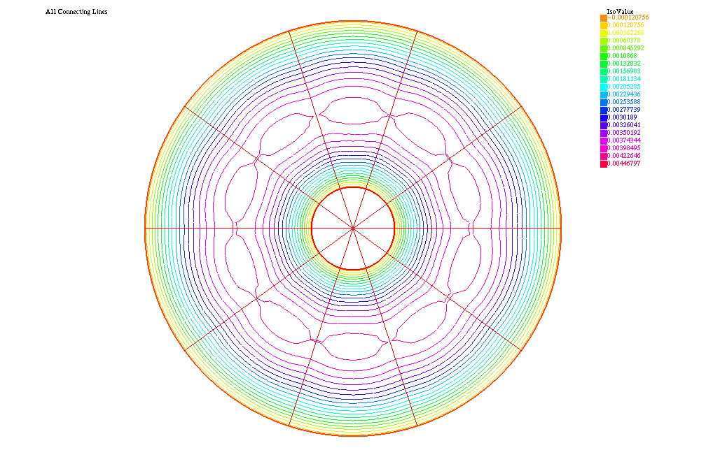
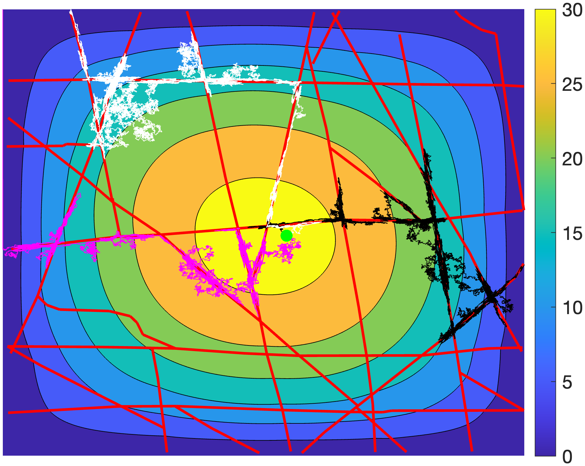
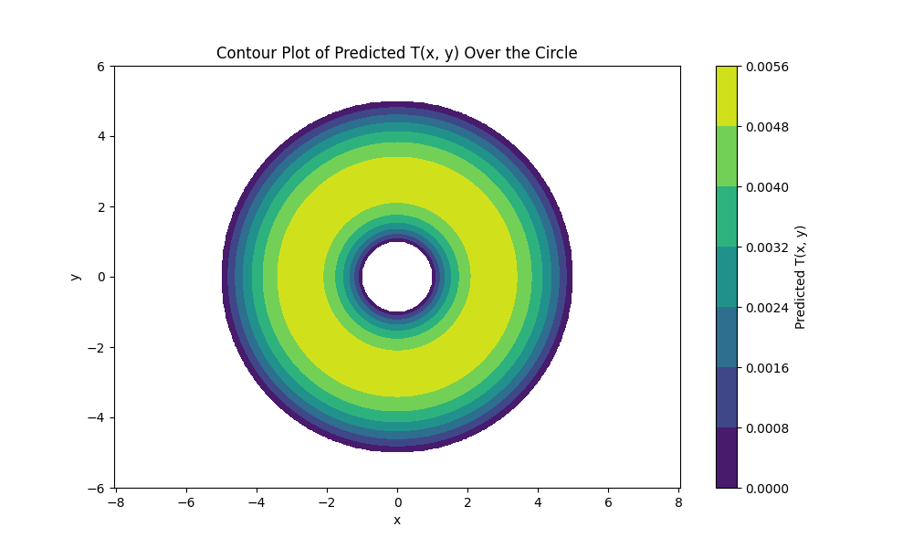
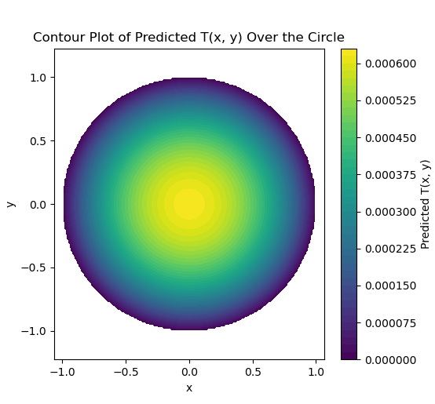
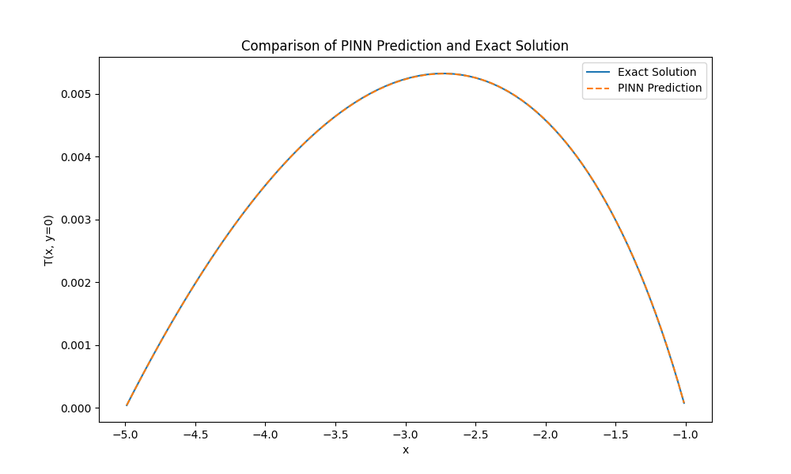
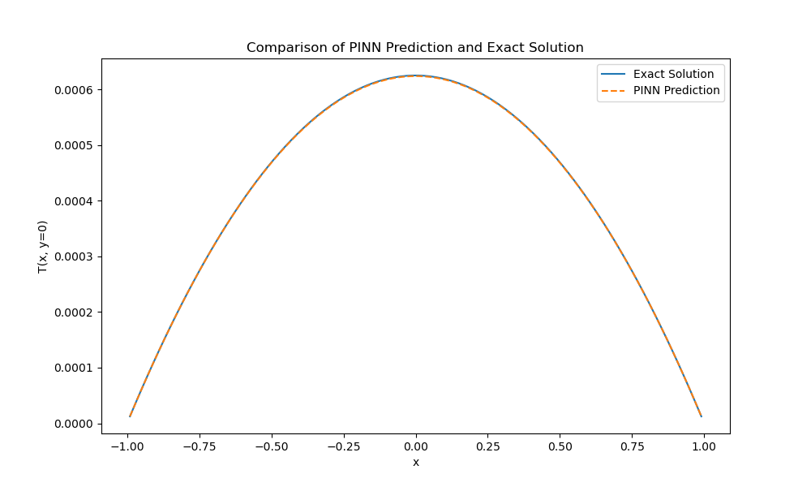

# Mean-First-Passage-Times-for-Transport-Equations
This repository contains the code and examples used in the research presented in the paper Mean First Passage Times for Transport Equations. You can find the full paper here: https://arxiv.org/abs/2404.00400

## Overview 
This repository provides the numerical implementations and visualizations for the examples discussed in the paper, showcasing applications of Mean First Passage Time (MFPT) theory to various transport equation scenarios. Key examples include:

## Numerical Methods

1. Circular Domain Example.  Simulates particle movement along microtubules within a circular domain.
   

    
    
   

2. Square Domain Example:Models the movement of wolves navigating through a domain, accounting for directional preferences such as seismic lines.

   
   

    
    
   

## Physics-Informed Neural Networks (PINNs)

This repository also includes the implementation of Physics-Informed Neural Networks (PINNs) for solving transport equations. The PINN model demonstrates high accuracy in predicting MFPT solutions. 

    
    
   

plotting both solution over x and comparing to the anayltical solution we get 

    
    
   

# Usage

This repository provides a comprehensive set of tools and scripts for reproducing the numerical simulations and examples detailed in the paper. Each section is accompanied by its corresponding implementation to ensure clarity and reproducibility.

Feel free to explore and modify the code to extend its applications or adapt it to other transport equation scenarios.
