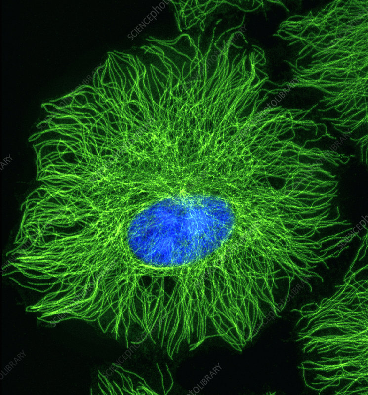

# Mean-First-Passage-Times-for-Transport-Equations
This repository contains the code and examples used in the research presented in the paper Mean First Passage Times for Transport Equations. You can find the full paper here: https://arxiv.org/abs/2404.00400

## Overview 
The repository includes implementations for the examples discussed in the paper, including:

## Numerical Methods

1. Circular Domain Example. Simulates particle movement along microtubules in a circular domain:
   

    
    
   

2. Square Domain Example: Models the movement of wolves in the wild

   
   

    
    
   

## Physics-Informed Neural Networks (PINNs)

Lastly This git hub repo includes the code for our Physics-Informed Neural Network 

    
    
   

# Usage

This repository provides a comprehensive set of tools and scripts for reproducing the numerical simulations and examples detailed in the paper. Each section is accompanied by its corresponding implementation to ensure clarity and reproducibility.

Feel free to explore and modify the code to extend its applications or adapt it to other transport equation scenarios.
